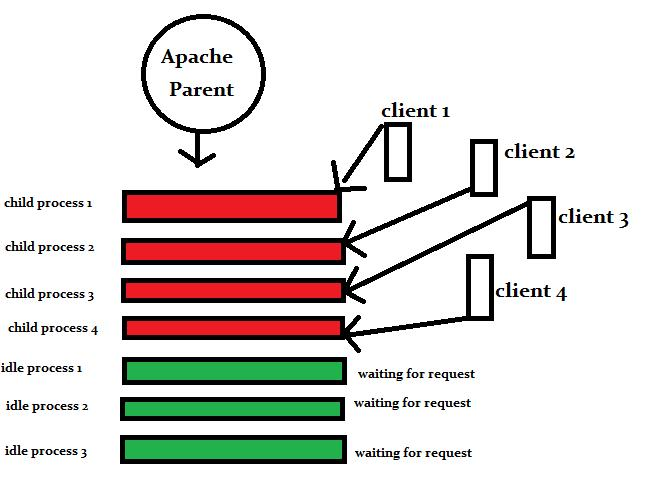
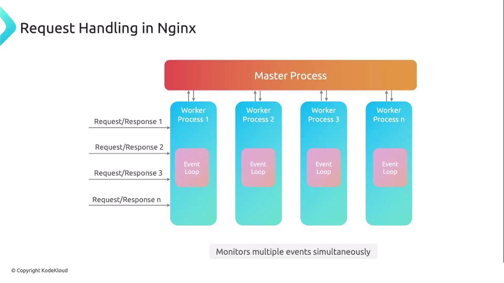
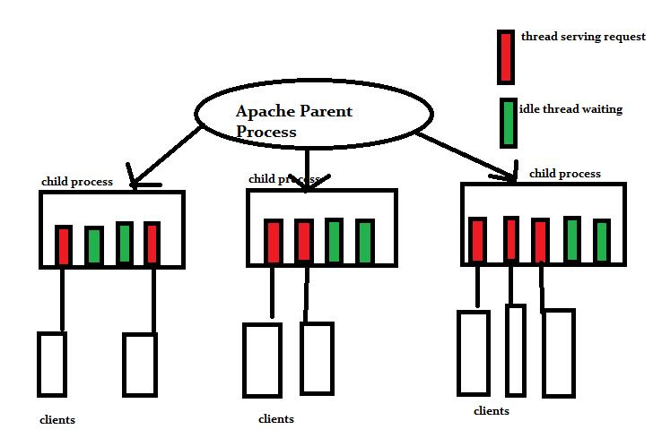
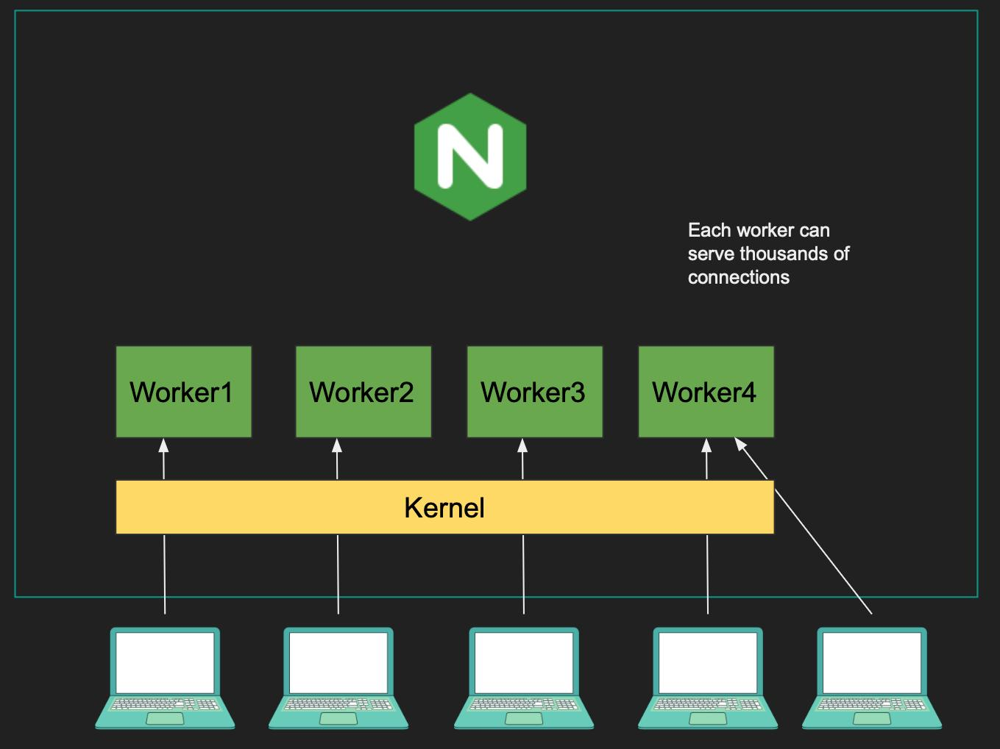
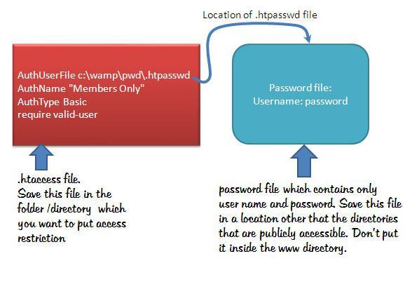

# ⚡ 1. Performance Comparison

### 🧠 Core Idea

```
Performance mainly depends on how the server handles requests internally.
```

```
There are two different architectures:
```

- Apache → Process / Thread-Based
- Nginx → Event-Driven

## 🔧 Apache Performance

<center></center>

### 📌 Working

- Each request = new process or thread
- Uses MPMs (Multi-Processing Modules)

```
Prefork -> process-based
Worker -> thread-based
Event -> hybrid
```

### ⚠️ Problem

- More users = more threads/processes
- High memory usage
- Context switching overhead

### 💡 Example

👉 If 10,000 users come → 10,000 threads/processes created (C10K Problem)

```
➡️ Server becomes heavy
```

## ⚡ Nginx Performance

<center></center>

### 📌 Working

- Uses event-driven, non-blocking architecture
- Single worker can handle thousnads of connections

### ✅ Advantage

- Low Memory Usage
- No Nedd to create threads per request
- Extremely efficient for scale

### 💡 Example

👉 1000 users → handled by few worker processes

```
➡️ No overload
```

### 📊 Real-World Impact

| Scenario     | Apache 🅰️  | Nginx 🅽       |
| ------------ | ---------- | ------------- |
| 100 users    | Works fine | Works fine    |
| 1000+ users  | Slows down | Still fast ⚡ |
| Memory usage | High       | Low           |
| Scalability  | Limited    | Excellent 🚀  |

### Nginx is optimized for performance and scalability, while Apache is heavier due to its request-per-thread model.

---

# 🚦 2. Handling Traffic

### 🧠 Core Idea

👉 “Handling traffic means how efficiently a server manages multiple users at the same time, which is called concurrency.”

### 🔢 What is Concurrency?

👉 Concurrency = number of simultaneous users/requests a server can handle

- 10 users → low concurrency
- 10,000 users → high concurrency 🚀

## 🔧 Apache (Concurrency Handling)

<center></center>

### 📌 How Apache Handles Traffic

- Each connection = 1 thread/process
- Uses MPM (Prefork / Worker / Event)

### ⚠️ What Happens Under High Traffic?

- More users → more threads
- Threads consume:

```
Memory
CPU
```

- Eventually:

```
Server becomes slow
May crash under extreme load
```

### 💡 Example

- 👉 5000 users = 5000 threads
- ➡️ Very heavy on system

## ⚡ Nginx (Concurrency Handling)

<center></center>

### 📌 How Nginx Handles Traffic

- Uses event loop + non-blocking I/O
- One Worker handles many connections

### ✅ What Happens Under High Traffic?

- No thread per user
- Efficient resource usage
- Stable even at 10k-50k+ connections

### 💡 Example

- 👉 5000 users = handled by few workers
- ➡️ Very efficient

### 📊 Real Comparison

| Factor             | Apache 🅰️                  | Nginx 🅽      |
| ------------------ | -------------------------- | ------------ |
| Concurrency Model  | Thread/Process per request | Event-driven |
| Max Connections    | Limited                    | Very High 🚀 |
| Performance @ Load | Decreases ❗               | Stable ⚡    |
| Resource Usage     | High                       | Low          |

### Apache scales vertically by adding more threads, while Nginx scales efficiently by handling multiple connections within a single worker.

### Nginx is designed for high concurrency, while Apache struggles as traffic increases.

---

# 🐘 3. mod_php vs PHP-FPM

### 🧠 Core Idea

👉 “This concept explains how Apache and Nginx execute PHP code.”

There are two approaches:

- Apache → mod_php (embedded PHP)
- Nginx → PHP-FPM (separate process manager)

## 🔧 What is mod_php? (Apache)

### 📌 How it Works

- PHP is embedded inside Apache
- Apache itself executes PHP

### 👉 Flow:

Client → Apache → PHP (inside Apache) → Response

### ✅ Advantages

- Simple setup
- No extra configuration
- Good for beginners

### ⚠️ Disadvantages

- High memory usage
- Every Apache process loads PHP
- Not efficient for high traffic

### 💡 Example

👉 Even for HTML request → PHP module still loaded

➡️ Waste of resources

## ⚡ What is PHP-FPM? (Used with Nginx)

### 📌 How it Works

- PHP runs as a seperate service

### 👉 Flow:

Client → Nginx → PHP-FPM → Response

### ✅ Advantages

- Better performance
- Lower memory usage
- Process pooling (reuse workers)
- Can handle high traffic

### ⚠️ Disadvantages

- Slightly complex setup
- Needs configuration

### mod_php runs PHP inside Apache, while PHP-FPM runs PHP as a separate service, making it more efficient and scalable.

---

# 📁 4. Static vs Dynamic Content

### 🧠 Core Idea

👉 “Web servers handle two types of content: static and dynamic.”

### 📌 What is Static Content?

- Pre-built files
- No Processing required

### Examples:

- HTML
- CSS
- JavaScript
- Images(JPG,PNG)

👉 Same content for every user

### 📌 What is Dynamic Content?

- Generated at runtime
- Depends on:

```
User Input
Database
Server Logic
```

### Examples:

- PHP pages
- Login systems
- Dashboards

👉 Different content for different users

## ⚡ Nginx (Best for Static Content)

### 📌 Why Nginx is Fast?

- Directly serves files from disk
- No extra processing
- Uses:

```
Caching
Efficient I/O
```

### 💡 Example

👉 Request: /image.png

➡️ Nginx sends file instantly ⚡

## 🔧 Apache (Dynamic Content Strength)

### 📌 Why Apache is Strong?

- Built-in support for dynamic content
- Works easily with:

```
PHP (mod_php)
Other modules
```

### 💡 Example

👉 Request: /profile.php

➡️ Apache processes PHP → queries DB → returns result

---

👉 “Nginx is optimized for serving static content quickly, while Apache is better at handling dynamic content directly

Static content like images and CSS is served much faster by Nginx because it directly delivers files.
Dynamic content like PHP is better handled by Apache, although Nginx uses PHP-FPM for efficient processing.

---

# ⚖️ 5. Flexibility vs Speed

### 🧠 Core Idea

👉 “This comparison shows the trade-off between flexibility and performance in web servers.”

## 🔧 Apache = Flexibility 🧩

<center></center>

### 📌 Why Apache is Flexible?

- Supports .htaccess(per-directory config)
- Huge number of modules:

```
mod_php
mod_rewrite
mod_security
```

- Can Change settings without restarting server

### ✅ Advantages

- Easy for Developers
- Fine-grained control (folder-wise)

### ⚠️ Trade-off

- Extra processing → slower performance
- More complexity → higher risk of misconfiguration

### 💡 Example

👉 You can block access to a folder using .htaccess

➡️ No server restart needed

## ⚡ Nginx = Speed 🚀

<center></center>

### 📌 Why Nginx is Fast?

- Minimal and clean configuration
- No .htaccess → no repeated file checks
- Event-driven architecture

### ✅ Advantages

- Extremely fast
- Low memory usage
- Stable under heavy load

### ⚠️ Trade-off

- Less flexible
- Requires config reload for changes

### 💡 Example

👉 To change config → edit main config file + reload server

### Apache is highly flexible due to .htaccess and modular design, making it developer-friendly.

Nginx focuses on speed and efficiency with a centralized configuration, making it ideal for high-performance systems.

---

# 📊 6.Final Tabular Comparison

| Feature              | Apache 🅰️                            | Nginx 🅽                        |
| -------------------- | ------------------------------------ | ------------------------------ |
| **Architecture**     | Process / Thread-based               | Event-driven                   |
| **Performance**      | Moderate                             | High ⚡                        |
| **Concurrency**      | Limited (thread per request)         | Very High (event loop) 🚀      |
| **Traffic Handling** | Good for low–medium traffic          | Excellent for high traffic     |
| **Static Content**   | Slower                               | Very Fast ⚡                   |
| **Dynamic Content**  | Strong (mod_php)                     | Uses PHP-FPM                   |
| **Memory Usage**     | High                                 | Low                            |
| **Security**         | Flexible (.htaccess) but higher risk | Strong & centralized 🔐        |
| **Flexibility**      | High                                 | Moderate                       |
| **Configuration**    | Distributed (.htaccess support)      | Centralized                    |
| **Ease of Use**      | Beginner-friendly                    | Requires learning              |
| **Best Use Case**    | Dynamic websites, shared hosting     | High-traffic, scalable systems |
| **Real-world Usage** | Backend processing                   | Reverse proxy, load balancer   |
